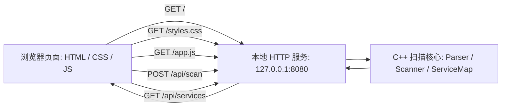

# SimplePortScanner Web Visualization V1 Plan

更新时间：2026-07-07

## 1. 阶段目标

V1 的目标是把当前只能在 PowerShell / Bash 中交互的 `SimplePortScanner` 做成一个可在本地浏览器中打开、填写参数并完成扫描的 Web 版工具。

本阶段不是做完整产品化仪表盘，而是先完成一条可用闭环：

1. 用户在本地启动程序的 Web 模式。
2. 浏览器打开本地页面。
3. 页面填写 IP、端口、超时时间、线程数等参数。
4. 点击开始扫描。
5. 页面显示加载状态、错误提示、扫描摘要和开放端口结果。

推荐启动方式：

```powershell
SimplePortScanner --web
```

推荐访问地址：

```text
http://127.0.0.1:8080
```

如果 8080 被占用，服务端可以提示用户改用其他端口；V1 可以先固定 8080。

## 2. V1 范围

### 2.1 V1 必须包含

- 本地 HTTP 服务，仅监听 `127.0.0.1`。
- 一个可直接访问的浏览器页面。
- 基础 HTML 页面结构。
- 基础 CSS 样式，做到清晰、可用、不像裸 HTML。
- 基础 JavaScript 交互反馈。
- 扫描参数表单。
- 扫描结果列表或结果卡片。
- 扫描摘要区域。
- 扫描结果直接呈现在页面中。
- 常见端口列表入口或区域。
- 使用说明入口或区域。
- 输入错误和扫描失败时的错误提示。

### 2.2 V1 暂不包含

- 取消扫描。
- 用户登录、多用户能力。
- 远程部署。
- React / Vue / Angular 等前端框架。
- npm / Node.js 构建流程。
- 移动端精细适配。

这些内容放到 V2 或后续阶段。

## 3. 推荐整体架构



核心原则：

- `Scanner` 只负责扫描，不负责页面和终端输出。
- `CliApp` 负责命令行交互。
- 新增 `WebApp` 或类似模块负责 HTTP 服务和 JSON 响应。
- 前端页面只通过 HTTP API 与本地后端交互，不直接调用 C++ 函数。

## 4. 前端文件建议

推荐新增目录：

```text
SimplePortScanner/web/
```

推荐文件：

```text
SimplePortScanner/web/index.html
SimplePortScanner/web/styles.css
SimplePortScanner/web/app.js
```

如果 V1 想减少运行时文件复制，也可以由 C++ 服务端内嵌这三个文件内容。但为了学习和维护，建议先保留独立静态文件。

## 5. 页面信息架构

V1 的页面信息架构只定义“需要有哪些信息区块”，不锁死最终视觉布局、导航方式或页面层级。后续如果需要做点击选项后进入下一层级页面、切换到分栏详情页、改成标签页或重排桌面端布局，都应该可以在不改后端 API 的情况下调整。

V1 实现时应避免把布局写死：

- HTML 使用清晰的区域容器，例如参数区、状态区、结果区、摘要区、帮助区。
- CSS 使用普通 class 控制布局，不把业务逻辑绑定到某一种桌面排版。
- JS 用独立函数渲染状态、摘要和结果，不把结果展示逻辑散落在多个点击事件里。
- V1 不实现“点击选项进入下一层级页面”，只在当前页面完成扫描闭环。

页面可以先采用工具型布局：

```text
顶部：项目名称 + 当前模式提示

主体：
左侧 / 上方：扫描参数面板
右侧 / 下方：扫描结果面板

底部或次级区域：
扫描摘要
常见端口列表
使用说明
安全提示
```

桌面端参考布局：

```text
┌──────────────────────────────────────────────┐
│ SimplePortScanner                            │
├───────────────┬──────────────────────────────┤
│ 扫描参数       │ 结果 / 状态                   │
│ IP 输入        │ 结果卡片 / 结果列表             │
│ 端口输入       │ 摘要                          │
│ 超时/线程       │                              │
│ 开始按钮       │                              │
├───────────────┴──────────────────────────────┤
│ 常见端口 / 使用说明 / 安全提示                 │
└──────────────────────────────────────────────┘
```

窄屏时可以自然上下排列：

```text
扫描参数
扫描状态
结果列表
扫描摘要
常见端口 / 使用说明
```

## 6. V1 页面控件

### 6.1 扫描参数表单

字段：

| 字段 | 类型 | 默认值 | 说明 |
|---|---|---|---|
| 目标 IP 或 IP 范围 | text | `127.0.0.1` | 支持单个 IPv4 或同 C 段范围 |
| 端口表达式 | text | `80,443,8080` | 支持单端口、范围、逗号组合 |
| 超时时间 | number | `500` | 单位 ms，最小 1 |
| 线程数 | number | `10` | 最小 1，最大建议沿用后端限制 |

扫描结果只在页面中展示。

按钮：

- 开始扫描。
- 重置表单。
- 清空结果。

V1 可以只实现“开始扫描”，但建议同时提供“清空结果”。

### 6.2 快捷端口按钮

可以放在端口输入框附近，点击后填入端口表达式：

| 名称 | 值 |
|---|---|
| Web | `80,443,8080,8443` |
| Remote | `22,3389,5900` |
| Database | `3306,5432,6379,27017` |
| Common | `21,22,23,25,53,80,110,143,443,445,3306,3389,5432,6379,8080` |

这是低成本但体验提升明显的功能，建议 V1 实现。

## 7. V1 视觉风格

V1 不追求复杂美术，但要有基础可用的视觉风格。

推荐风格：简洁的网络安全工具 / 本地控制台仪表盘。

建议：

- 深色或浅色均可，但要保持对比度清楚。
- 不使用花哨动画。
- 不使用大面积装饰图。
- 表单、按钮、结果卡片、摘要卡片要紧凑清晰。
- 状态颜色统一。

状态颜色建议：

| 状态 | 颜色语义 |
|---|---|
| Open | 绿色 |
| Closed | 灰色 |
| Timeout | 黄色 |
| Error | 红色 |
| Scanning | 蓝色或青色 |

V1 页面不应只有裸 HTML。至少要完成：

- 页面最大宽度或合理内边距。
- 表单控件统一高度和边框。
- 按钮 hover / disabled 状态。
- 结果列表、结果卡片、行间距、空状态。
- 错误提示框。
- 扫描中提示。

## 8. JavaScript 交互要求

V1 的 JS 是交互核心，不是装饰。

必须实现：

1. 读取表单值。
2. 做基础前端校验。
3. 点击“开始扫描”后禁用按钮和表单。
4. 按钮文案改为“扫描中...”。
5. 显示加载状态。
6. 调用 `POST /api/scan`。
7. 扫描成功后渲染摘要和结果列表。
8. 扫描失败后显示错误提示。
9. 请求结束后恢复按钮和表单。

前端基础校验：

- IP 表达式不能为空。
- 端口表达式不能为空。
- 超时时间必须是正整数。
- 线程数必须是正整数。

复杂校验交给后端复用现有 `IpParser` 和 `PortParser`。

## 9. API 约定

### 9.1 `GET /`

返回 `index.html`。

### 9.2 `GET /styles.css`

返回页面样式。

### 9.3 `GET /app.js`

返回页面脚本。

### 9.4 `GET /api/services`

返回常见端口列表。

示例响应：

```json
{
  "services": [
    { "port": 21, "name": "FTP" },
    { "port": 22, "name": "SSH" },
    { "port": 80, "name": "HTTP" },
    { "port": 443, "name": "HTTPS" }
  ]
}
```

### 9.5 `POST /api/scan`

请求：

```json
{
  "ipExpression": "127.0.0.1",
  "portExpression": "80,443,8080",
  "timeoutMs": 500,
  "threadCount": 10
}
```

成功响应：

```json
{
  "ok": true,
  "summary": {
    "hostCount": 1,
    "portCount": 3,
    "totalTasks": 3,
    "openPorts": 1,
    "closedPorts": 2,
    "timeoutPorts": 0,
    "elapsedSeconds": 1.03
  },
  "openResults": [
    {
      "ip": "127.0.0.1",
      "port": 8080,
      "service": "HTTP-ALT",
      "timeMs": 12,
      "banner": ""
    }
  ]
}
```

失败响应：

```json
{
  "ok": false,
  "error": "端口表达式无效：非法端口范围"
}
```

HTTP 状态码建议：

| 场景 | 状态码 |
|---|---|
| 成功 | 200 |
| 参数错误 | 400 |
| 路由不存在 | 404 |
| 服务端错误 | 500 |

## 10. 结果展示要求

### 10.1 扫描中状态

V1 扫描中只需要显示：

```text
扫描进行中，请稍候...
```

可同时显示预计任务数：

```text
即将扫描 N 个 IP × M 个端口 = T 个任务
```

如果前端不解析表达式，则该信息可由后端在响应后展示；V1 也可以只在扫描完成后展示任务数。

### 10.2 成功状态

扫描完成后展示：

- 开始 / 结束提示或完成提示。
- 扫描摘要。
- 开放端口结果列表。

开放端口结果卡片建议字段：

| 字段 | 说明 |
|---|---|
| IP | 目标 IP |
| Port | 端口 |
| Service | 默认服务名 |
| Time | 本次扫描耗时 |
| Banner | Banner 内容，可能为空 |

如果没有开放端口，展示空状态：

```text
未发现开放端口。
```

展示形式不强制使用传统数据网格。V1 推荐使用结果卡片或紧凑列表，让每个开放端口像一条扫描发现记录：

```text
OPEN  127.0.0.1:8080  HTTP-ALT
耗时 12 ms
Banner: ...
```

不要把 closed / timeout 每一项全部列出来，V1 沿用当前命令行逻辑，只展示开放端口和统计数量。

### 10.3 错误状态

错误提示应出现在结果区域上方或表单附近。

示例：

```text
扫描失败：IP 表达式无效，非法 IP 地址：192.168.1.999
```

错误后不清空用户输入，方便修改。

## 11. 安全边界

页面必须明确提示：

```text
请仅扫描本机、实验环境、虚拟机或已授权的目标。
```

本地 HTTP 服务 V1 只监听：

```text
127.0.0.1
```

不要监听 `0.0.0.0`，避免局域网其他设备访问这个扫描接口。

V1 不提供远程访问能力。

## 12. 后端实现提示

虽然本文档重点是前端页面方案，但 V1 前端必须依赖本地后端 API。

推荐新增文件：

```text
SimplePortScanner/src/WebApp.h
SimplePortScanner/src/WebApp.cpp
```

推荐改造：

```text
SimplePortScanner/src/main.cpp
```

`main.cpp` 中根据命令行参数选择模式：

```text
无参数：运行原 CLI 菜单
--web：运行本地 Web 服务
```

V1 只实现 `--web`，默认监听 `127.0.0.1:8080`。

注意：当前 `scanTargetsConcurrent()` 会在扫描结束后直接打印开放端口到 `cout`。Web 模式更适合让扫描函数只返回结构化结果。后续实现时建议拆出一个不直接打印的扫描函数，CLI 再自行打印。

## 13. CMake 更新提示

如果新增 `WebApp.h/.cpp`，需要更新：

```text
SimplePortScanner/CMakeLists.txt
```

把新源文件加入 `add_executable`。

Windows 下 HTTP 服务仍可复用现有 `NetCompat` 或 Winsock 初始化能力。Linux / WSL 下保持跨平台兼容。

## 14. V1 验收标准

### 14.1 功能验收

- 执行 `SimplePortScanner --web` 后，本地服务启动。
- 浏览器访问 `http://127.0.0.1:8080` 能看到页面。
- 页面能填写目标 IP、端口、超时时间、线程数。
- 点击开始扫描后，按钮进入扫描中状态。
- 扫描期间不能重复提交。
- 扫描完成后能看到摘要。
- 扫描完成后能看到开放端口结果列表。
- 无开放端口时显示空状态。
- 输入非法 IP 时显示错误。
- 输入非法端口表达式时显示错误。
- 原命令行模式仍然可用。

### 14.2 UI 验收

- 页面不是裸 HTML。
- 表单布局清晰。
- 结果列表或结果卡片可读。
- 错误提示醒目。
- 扫描中状态明确。
- Open / Error 等状态有颜色区分。
- 浏览器窗口变窄时内容不明显重叠或溢出。

### 14.3 安全验收

- 服务默认只监听 `127.0.0.1`。
- 页面包含授权扫描提示。
- 不提供远程访问说明。

## 15. 推荐实现顺序

1. 新增 Web 静态文件目录和页面骨架。
2. 完成基础 CSS，让页面结构清晰。
3. 完成 `app.js` 的表单读取、状态切换和结果渲染逻辑。
4. 新增 Web 后端模块，先能返回 `/`、`/styles.css`、`/app.js`。
5. 新增 `GET /api/services`。
6. 新增 `POST /api/scan`，接入现有 IP / 端口解析和扫描函数。
7. 处理错误响应。
8. 更新 `main.cpp`，支持 `--web`。
9. 更新 CMake。
10. 构建并手动验证 CLI 模式和 Web 模式。

## 16. 后续阶段原则

后续阶段不预设新的扫描输入能力或大型界面能力。只有当用户明确需要时，再单独评估是否加入。

如果 V1 完成后需要继续提升体验，优先考虑低负担改进：

- 更清晰的扫描中状态。
- 更好看的结果卡片。
- 常见端口分组选择。
- 结果排序和筛选。
- 输入CIDR的功能可以加
- 主机名解析也可以加
## 17. V1 结论

V1 应优先完成“本地浏览器可交互扫描”的最小闭环。CSS 和 JS 不应完全后置：V1 需要基础样式和基础反馈，否则虽然接口可用，但用户无法判断工具状态，也不利于后续继续迭代。

本阶段推荐采用：

```text
C++ 本地 HTTP 服务 + 原生 HTML/CSS/JS + 复用现有扫描核心
```

这样不会引入大型前端工程体系，也能最大限度贴合当前 C++ 项目的学习和维护目标。
